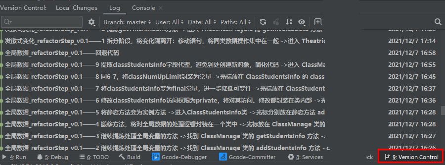
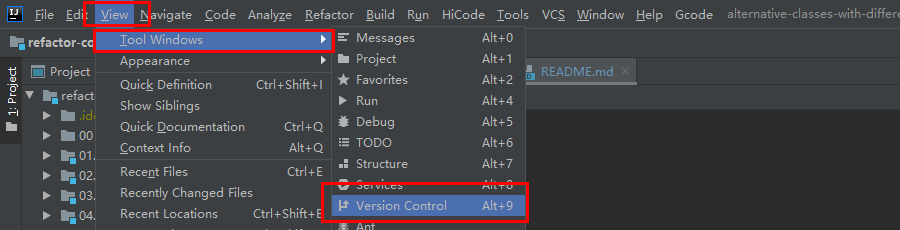
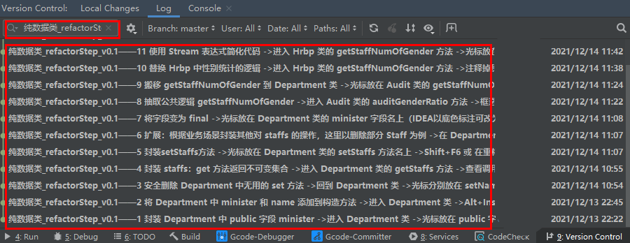
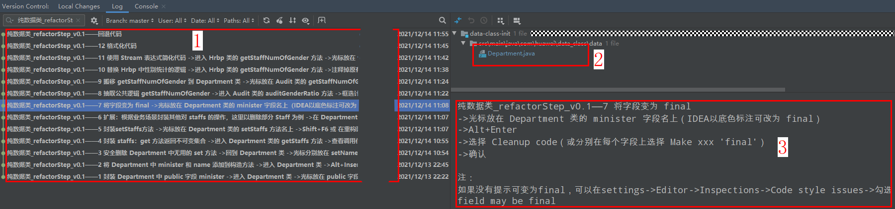
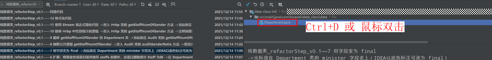
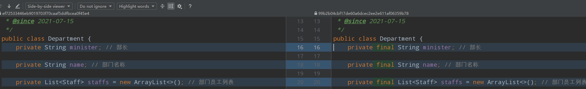
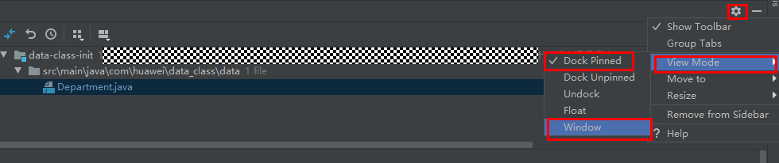

# RefactorCourseDemo

华为云·重构 
视频链接：https://education.huaweicloud.com/courses/course-v1:HuaweiX+CBUCNXLJ014+Self-paced/about

代码主要分为如下3个部分，大家可以结合视频讲解进行操作演练：
1. 重构前的代码（init）：每个模块下 init 后缀的模块，如 22.data-class/data-class-init
2. 重构后的参考代码（ref）：每个模块下 ref 后缀的模块，如 22.data-class/data-class-ref
3. 代码操作步骤：如 22.data-class/Refactoring Actions.md文档

其中，部分坏味道的 Refactoring Actions.md文档 以 git log 的形式给出，包括操作步骤和每步操作的代码对比，使用方式如下：（以“纯数据类”坏味道为例）
**重要：文本演示中，仅在手动修改的操作步骤，强调了运行测试。大家在操作演练或实际项目重构中，要尽可能多的运行测试，且尽量小步提交，最好能保障每次提交的代码都是通过测试验证的**
1. Alt+9 打开重构面板（也可以通过 View->Tool Windows->Version Control 打开）
   - Alt+9 打开面板
    
   - View->Tool Windows->Version Control 打开面板
    
2. 如下，搜索框输入 “纯数据类_refactorStep_v0.1”，回车确认
   - 具体搜索的 “文本和版本信息” 在各坏味道模块的 Refactoring Actions.md文档中
    
3. 如下图，左侧面板为 commit 记录列表，右上方有代码的 diff 详情，右下角为具体的操作步骤
   - 1——commit 记录列表
   - 2——代码的 diff 详情
   - 3——具体的操作步骤，以及一些写在“注”中的提示信息
    
4. 可结合 diff 信息，查看每步的代码变化
   - 1——在文件上 Ctrl+D 或 鼠标双击，可以打开 diff 详情
    
   - 2——在 diff 详情里，使用 F7/Shift+F7 可以跳转到 下一处/上一处 改动，F4 可跳转到代码文件，Esc 可关闭 diff 面板 
    
   - 3——双屏学习时的小技巧，log 面板默认是停靠面板（Dock Pinned），可以 设置->View Mode->Window 将其弹出为专门窗口
    
